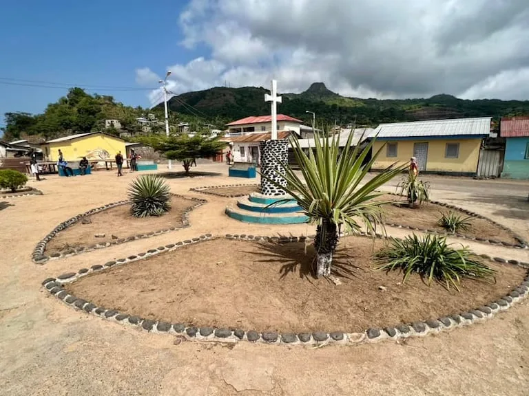
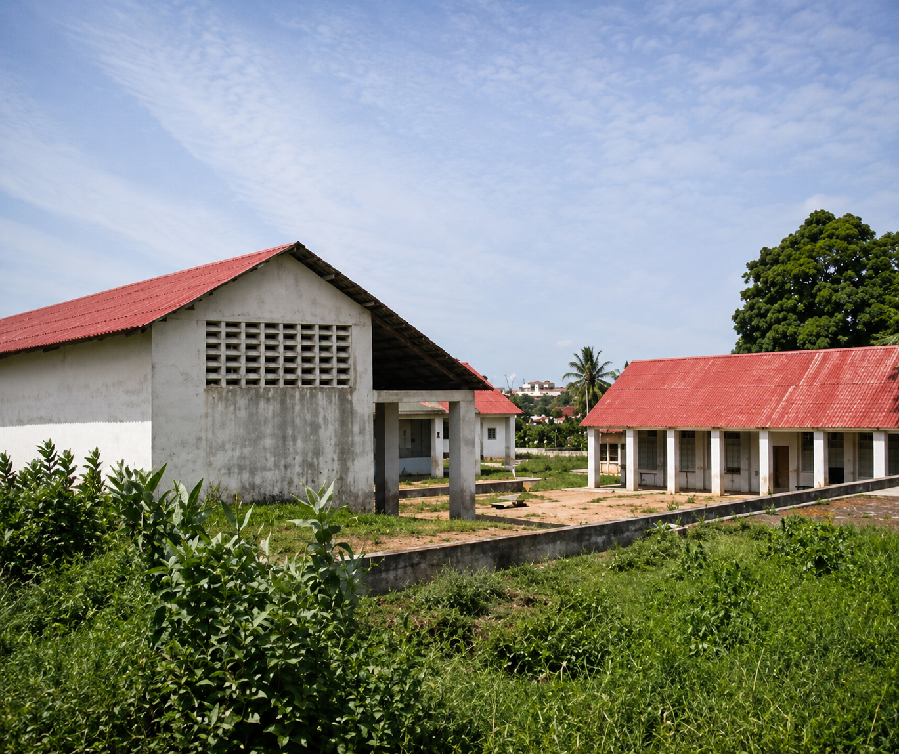

**Foto 1. Vista panorámica de la isla de Annobón.**

Vista aérea de la isla de Annobón, que muestra el núcleo urbano de San Antonio de Palé, el aeródromo y el lago volcánico Lago a Pot. Esta imagen permite comprender la geografía singular de la isla y su aislamiento en el océano Atlántico.

## Foto 2 – San Antonio de Palé

**Descripción**

Vista de un espacio público en San Antonio de Palé, principal núcleo urbano de la isla de Annobón. La imagen refleja el entorno cotidiano de la comunidad y ayuda a comprender el contexto social en el que se desarrollará el proyecto «Un Juguete, una Ilusión».

**Comentario**

La vida comunitaria constituye un elemento esencial de la identidad de Annobón. Los espacios públicos favorecen la convivencia y representan lugares adecuados para el desarrollo de actividades educativas, recreativas y de participación infantil.

## Foto 3 – Antigua escuela de Annobón (fotografía de archivo)

**Descripción**

Fotografía histórica de la antigua escuela de Annobón. Este edificio ya no existe, ya que fue demolido y posteriormente sustituido por el actual centro médico de la isla.

**Comentario**

Esta imagen se incluye únicamente como documento de archivo para ilustrar una parte de la evolución de las infraestructuras públicas de Annobón. No representa la situación actual.